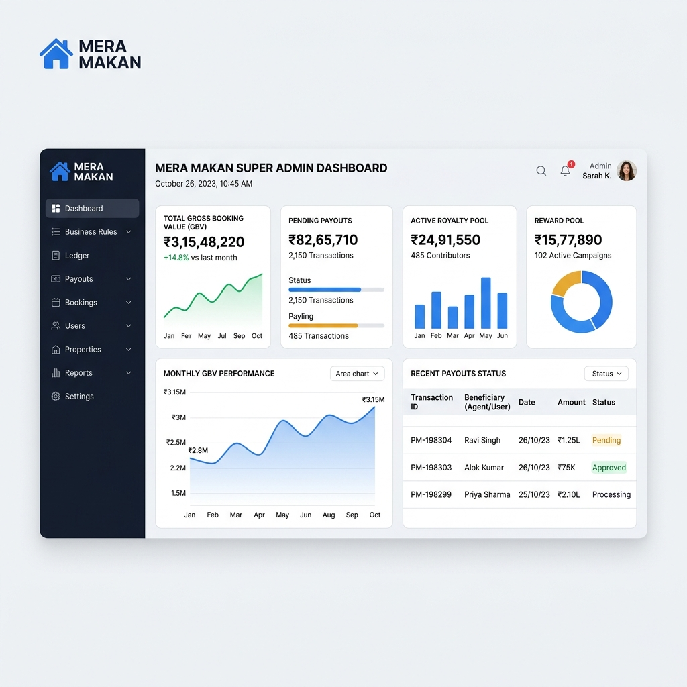

# MERA MAKAN - Admin Console Design

The Admin Console is the source of truth for Operations, Finance, and Compliance. It is built to process high-volume transactions while providing perfect auditability for every state change.

## Core UX Principle
**"What happened? Why was it calculated? Can I audit it?"**

## Visual Mockup

## Information Architecture

### 1. Global Financial Dashboard
- **Company Health:** Total Gross Booking Value vs Total Collected.
- **Liabilities:** Pending Referral Payouts, Balance Sheet Liabilities, Active Royalty Pool size.
- **Exceptions:** Failed payments, Chargebacks, Held payouts.

### 2. Business Rules Engine (Super Admin Only)
- Dedicated settings page grouping the 5 business streams.
- Shows: `Current Value`, `Effective Date`, `Approval Status`.
- **Warning UI:** Any rule pending CEO approval is highlighted in red, blocking production payout batches until resolved.

### 3. Central Ledger & Reconciliation
- The immutable financial history viewer.
- Filters: Date, Source (Sale, Payment, Reversal), User.
- Ability to perform "Void" or "Adjust" actions (which create offsetting entries rather than deleting data).

### 4. Payout Batch Processor
- Interface for Finance Admin to review the 5th, 15th, and 25th cycle closings.
- One-click "Approve Batch" which logs the IP, Timestamp, and Admin ID.
- Downloadable CSVs formatted specifically for the chosen Payment Gateway / Bank Portal.

### 5. Inventory & Booking Management
- Visual grid of Society/Projects.
- Color-coded plots (Available, Reserved, Booked).
- Deep dive into a specific booking to see the full state machine transition history.

## Security Constraints enforced in UI
- Destructive actions (like Adjustments or Refunds) require secondary confirmation or MFA.
- Hard deletes are disabled system-wide.
- UI elements (like the Business Rules tab) completely disappear from the DOM if the user lacks `SUPER_ADMIN` rights, backing up the server-side RBAC.
