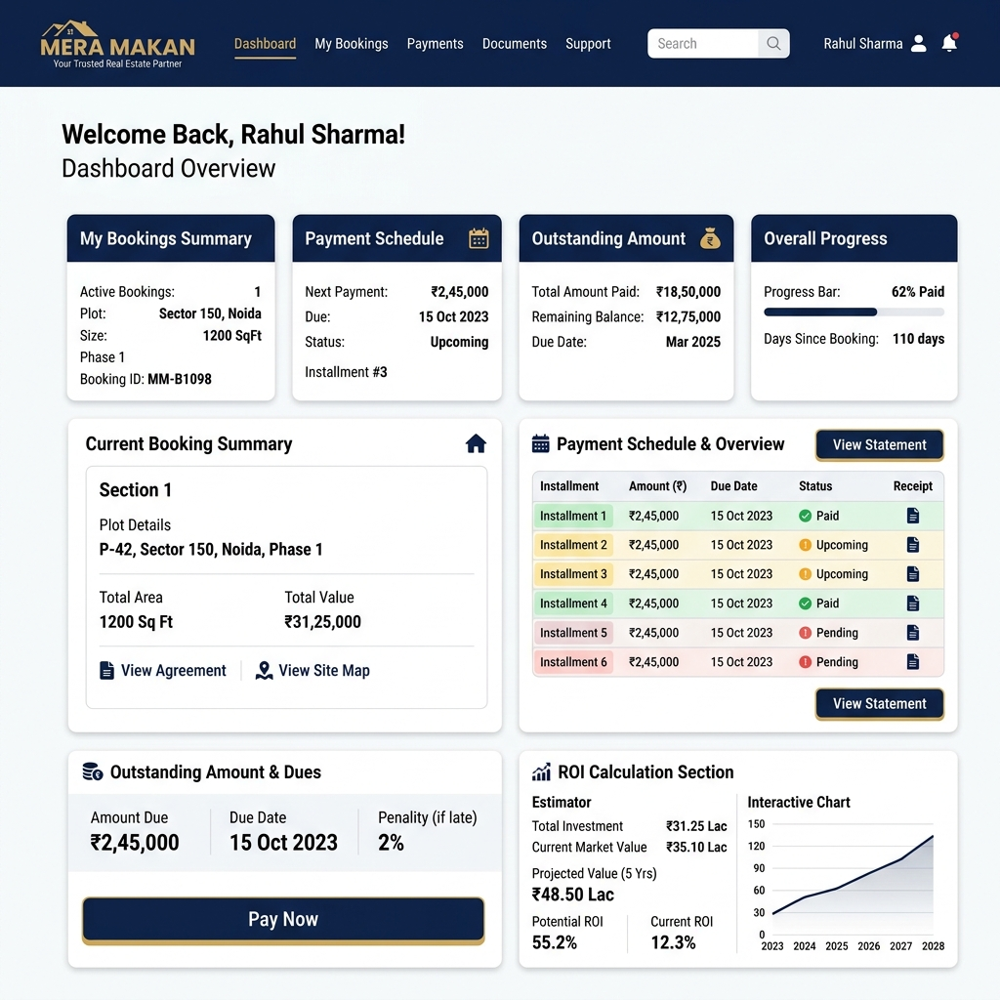

# MERA MAKAN - Customer Portal Design

The Customer Portal is designed to provide complete transparency for property buyers while strictly isolating internal business logic (commissions, royalties, partner tiers) from their view.

## Core UX Principle
**"What did I buy? How much have I paid? What is left?"**

## Visual Mockup

## Information Architecture

### 1. Dashboard / Overview
- **My Property Summary:** Plot Number, Size, Base Price.
- **Financial Status:**
  - Total Plot Amount: ₹3,50,000
  - Registration Amount: ₹1,000
  - Total Customer Amount: ₹3,51,000
  - Total Paid to Date
  - Outstanding Balance
- **Next Action:** Next payment due date and amount.

### 2. Payment Schedule & History
- Visual timeline of the 90-Day Payment Plan (e.g., 30% / 30% / 40%).
- Status badges: `PAID`, `PENDING`, `OVERDUE`.
- **Receipts:** One-click download of verified payment receipts.

### 3. Cash Plot ROI Viewer (Conditional)
- *Visible ONLY if the booking is tagged as ROI-Eligible by Admin.*
- Displays: 1% ROI Monthly Rate, Start/End Dates, Total Credited, Total Paid to Bank.

### 4. Document Vault
- Repository for generated PDFs:
  - Booking Confirmation
  - Agreement / Papers
  - NOC / Registry Status

## Security Constraints enforced in UI
- No references to the referring Partner's identity or commission.
- "Pay Now" buttons lock the exact amount owed; customers cannot manually alter the schedule amounts.
- All documents are served via signed URLs with time-limited access.
