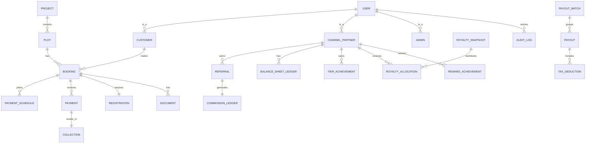

# MERA MAKAN - Database Schema & ERD

This document provides the normalized database design for the system, ensuring strict financial reconciliation and auditability.

## Entity Relationship Diagram (Core)

## Critical Tables & Constraints

### Users & Roles
- **User**: ID, Name, Phone, Hash, RoleID, IsActive.
- **Role**: ID, Name (SUPER_ADMIN, FINANCE_ADMIN, etc.), Permissions (JSON/Bitmask).
- **Customer**: ID, UserID, KYCStatus.
- **ChannelPartner**: ID, UserID, PAN, BankDetails, SponsorID (Self-referential for generation tree).

### Property & Sales
- **Project**: ID, Name, Location, TotalArea, IsActive.
- **Plot**: ID, ProjectID, PlotNumber, SizeGaj, RatePerGaj, PlotAmount, Status (AVAILABLE, RESERVED, SOLD).
- **Booking**: ID, PlotID, CustomerID, ChannelPartnerID, BookingStatus, TotalAmount (Plot + Reg), RuleVersionID.
- **PaymentSchedule**: ID, BookingID, MonthNumber, Percentage, DueAmount, DueDate.
- **Registration**: ID, BookingID, Amount, Status.

### Payments & Ledger
- **Payment**: ID, BookingID, Amount, GatewayRef, Status, Date.
- **Collection**: ID, PaymentID, Amount, ClearedDate, VerifiedByAdminID.
- **FinancialLedger** (Unified Immutable Ledger): ID, Date, SourceType (SALE, PAYMENT, REFERRAL, etc.), SourceID, Debit, Credit, Currency, Status, CreatedBy, RuleVersionID, AuditTimestamp.
  - *Constraint*: Entries are insert-only. Adjustments require a new reversing entry.

### Commissions & Payouts
- **CommissionRule**: ID, StreamType (REFERRAL, BALANCE_SHEET, etc), Rate, ValidFrom, ValidTo.
- **ClosingCycle**: ID, StartDate, EndDate, Status (OPEN, CLOSED, PROCESSING, PAID).
- **Referral**: ID, BookingID, ChannelPartnerID, GrossAmount, Status.
- **RoyaltySnapshot**: ID, Month, Year, Turnover, PoolAmount, Status.
- **TierAchievement**: ID, ChannelPartnerID, TierName, DateAchieved, QualifyingBookingID, Status, SupersededByTier.
- **RewardAchievement**: ID, ChannelPartnerID, RewardName, QualifyingBookingID, Status.
- **PayoutBatch**: ID, Type, TotalAmount, Status, GeneratedDate.
- **Payout**: ID, BatchID, BeneficiaryID, SourceRef (e.g. ReferralID), Gross, Deduction, TDS, Net, Status, IdempotencyKey.

## Security & State Enforcement
- **Idempotency Keys**: Required on `Payout` table to prevent duplicate webhook processing.
- **Locking**: Row-level locks (e.g. `SELECT FOR UPDATE`) must be used when modifying ledger/payout states.
- **Rule Versioning**: `RuleVersionID` is snapshotted onto `Booking` and `Ledger` to freeze calculations in time.
