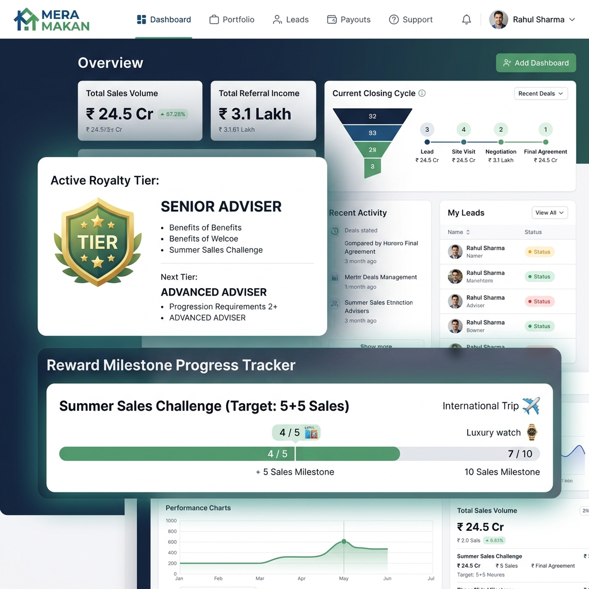

# MERA MAKAN - Channel Partner Portal Design

The Channel Partner Portal is designed as a professional financial and sales tracker. It strictly differentiates between "Eligible" earnings (which are mathematically qualified) and "Approved/Paid" earnings (which have passed compliance). 

## Core UX Principle
**"What have I sold? What is eligible? What is my tier?"**

## Visual Mockup

## Information Architecture

### 1. Performance Dashboard
- **Sales Metrics:** Total Gross Booking Value, Total Collected Value.
- **Closing Cycle:** Active cycle indicator (e.g., "Cycle: 21-30", "Closes in 4 days").
- **Referral Income:** Separated into `ELIGIBLE`, `PROCESSING`, and `PAID`.

### 2. Tier & Royalty Tracker
- **Current Tier Badge:** Visual indicator (e.g., Senior Adviser, Supervisor).
- **Royalty Status:** "Active for X more months".
- **Progress to Next Tier:** (e.g., "3 more full-cash sales to reach Manager (100+100)").

### 3. Rewards Milestone Tracker
- Visual progress bar showing full-cash collections vs reward thresholds.
- Unlocked rewards history.

### 4. Balance Sheet 
- Dedicated tab for the "Generation to Generation" metrics.
- Shows Current Balance, Output for the cycle, and Carry Forward amounts.

### 5. My Customers (CRM)
- List of referred customers.
- Shows customer's payment progress (vital for unlocking Partner's full-cash dependent Royalty/Rewards).
- **Constraint:** Does not show customer's ROI earnings or sensitive personal passwords.

## Security Constraints enforced in UI
- Never displays "Estimated" income that hasn't cleared ledger rules.
- Tax/TDS deductions are explicitly visible on every payout line item to avoid disputes.
