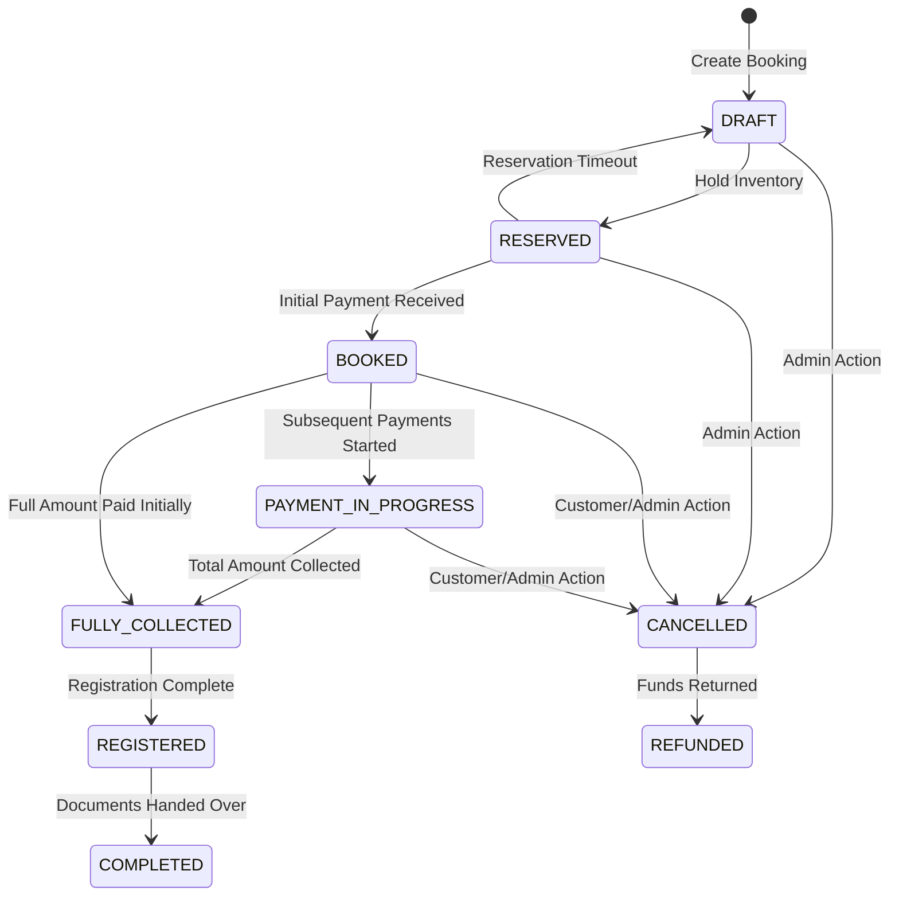
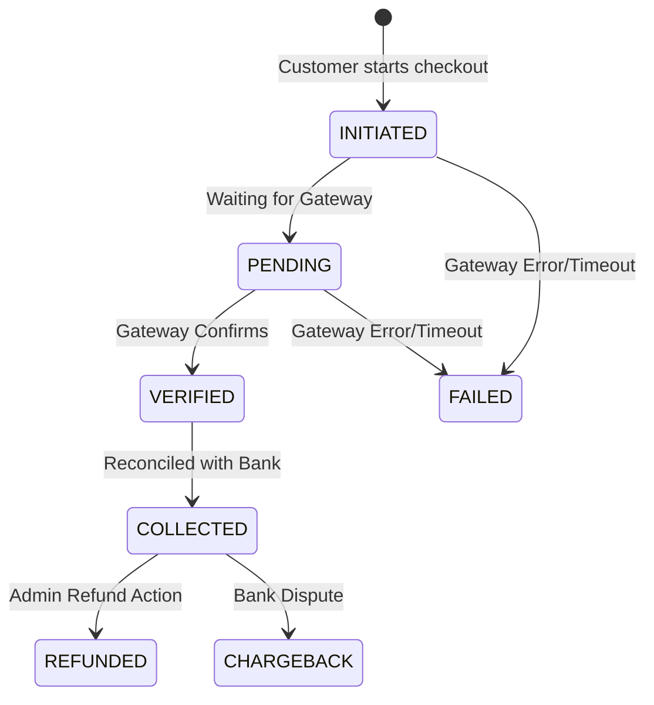
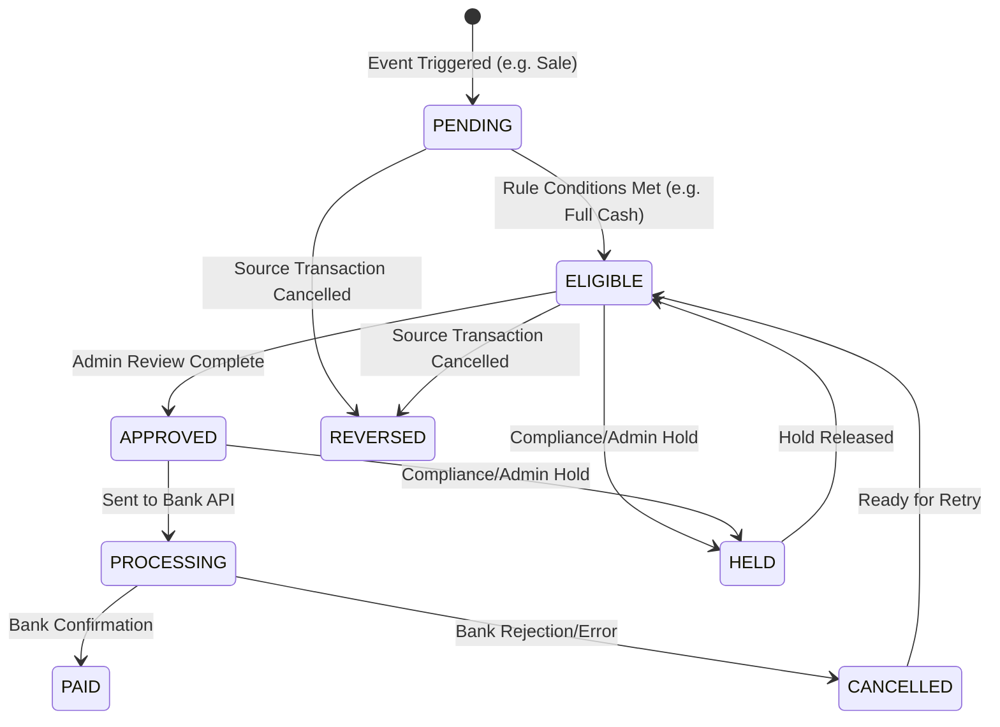

# MERA MAKAN - Financial State Machine

This document defines the strict lifecycle and state transitions for the core entities in the Mera Makan system. Invalid state transitions will be blocked at the database and application levels.

## 1. Booking State Machine

> [!IMPORTANT]
> A booking must reach `FULLY_COLLECTED` before any Royalty or Reward calculation is triggered for the associated channel partner.

## 2. Payment State Machine

> [!WARNING]
> Only payments in the `COLLECTED` state can be used as inputs for commission, royalty, and reward ledgers.

## 3. Payout State Machine (For Commissions, Balance Sheet, Royalty, Rewards, ROI)

> [!NOTE]
> All payout transitions must log the `Admin ID` and `Timestamp` for auditing purposes. No financial state can be changed without a verifiable audit trail.
